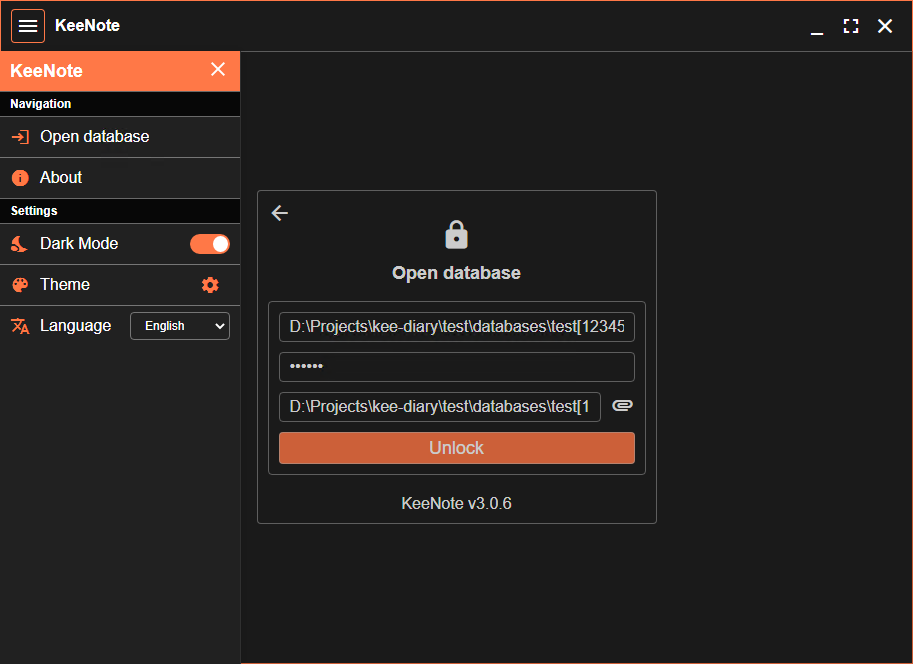
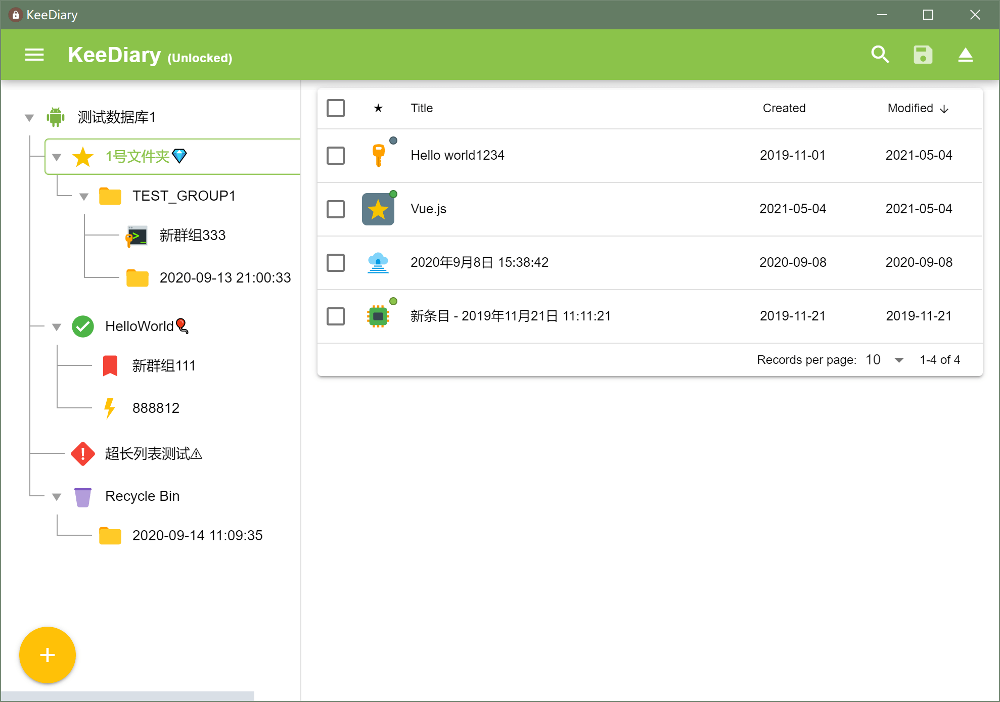
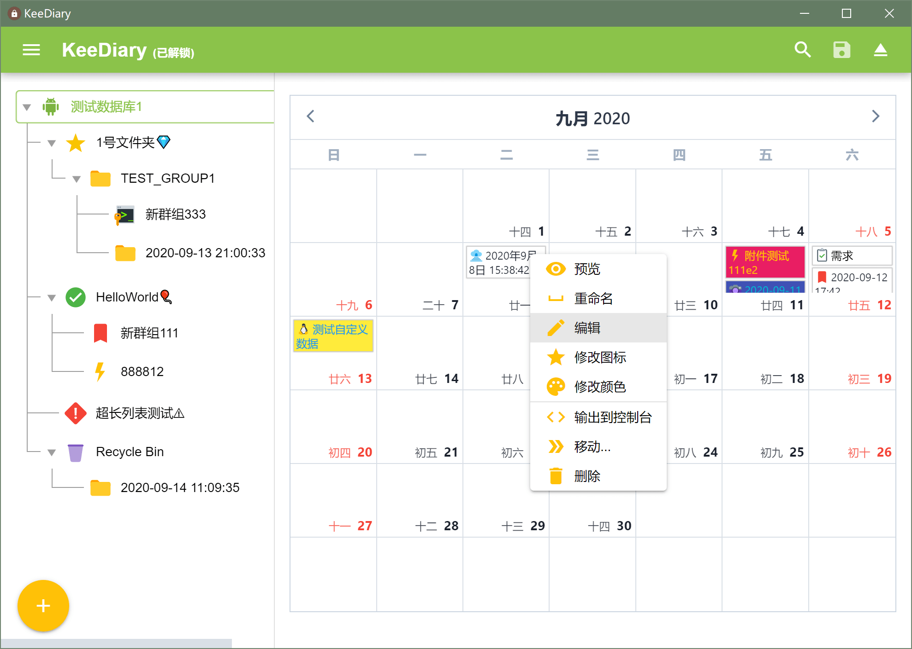
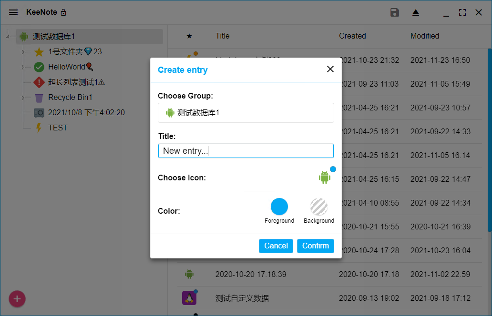
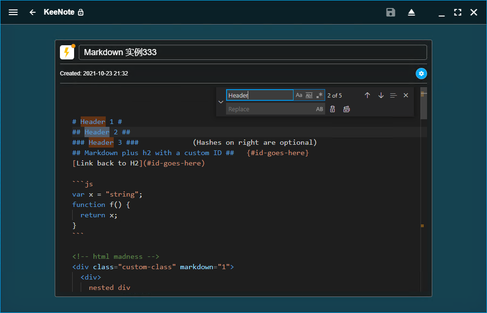
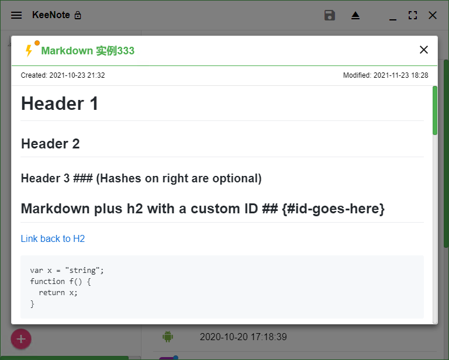
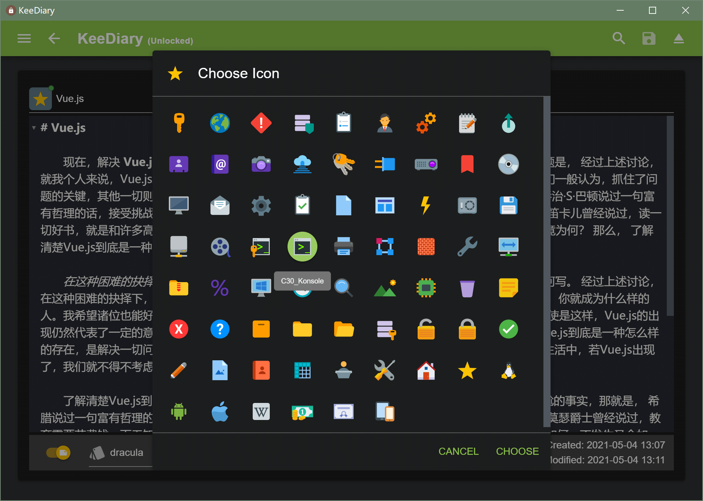
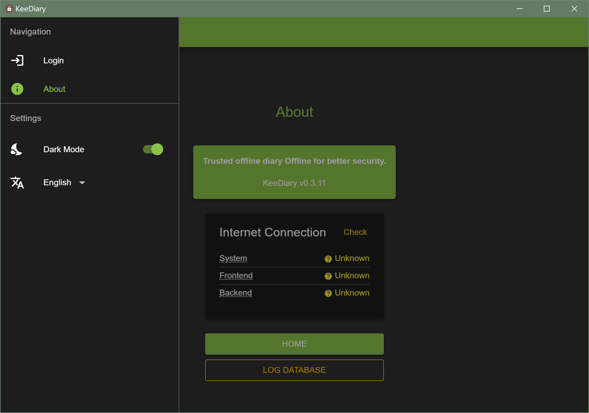

# KeeDiary

## Introduction

A diary editor application that uses KeePass technology to encrypt storage. With Syncthing, you can easily synchronize on different devices.

The following techniques are used:

- Electron
- Vue / Quasar UI
- [kdbxweb](https://github.com/keeweb/kdbxweb)

## Screenshots









## Features

- [x] Open a database (`password`/`password+key`)
- [x] Save database/close database
- [x] Full database search
- [x] Dark mode
- [x] Welcome page
- [x] About page
- [x] Multiple language support
- [x] Check Internet connection (Offline for better security)
- Groups
    - [x] Create new entry
    - [x] Create new group
    - [x] Rename group
    - [x] Change icon
    - [x] Move group
    - [x] Move to the recycle bin
    - [x] Empty trash
- Entries
    - [x] List view (sort)
    - [x] Calendar view
    - [x] Change icon
    - [x] Change color
    - [x] Markdown support
    - [x] Preview
    - [x] Rename entry
    - [x] Edit (CodeMirror)
    - [ ] Edit with external tools
    - [x] Import/Export
    - [x] Move entry
    - [x] Delete entry

## Development

```sh
# Install dependencies
yarn install
yarn install --cwd "./frontend"

# Run development
yarn run dev
```

## Build production

```sh
# Global install: electron-builder
npm -i -g electron-builder

# Build frontend first
yarn run build:frontend

# Build electron executable file
yarn run build:electron
```

## Remarks

- `kdbxweb` It is a function library for operating the kdbx database. Due to domestic network problems, [copy version](https://gitee.com/canwdev/kdbxweb) is used，there are no other changes.


